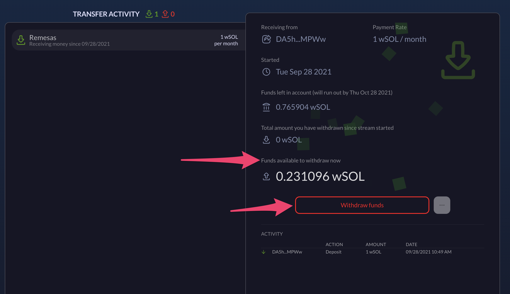

# Retiros De Cuenta

### Retiradas (para transferencias)

Cuando usted es el destinatario de una transferencia, verá las transferencias entrantes en la pestaña Transferencias. El importe disponible para retirar se muestra en los detalles de la transferencia.

Cuando esté listo para retirar, simplemente haga clic en el botón "Retirar fondos", y especifique la cantidad. Una vez confirmada la retirada en su monedero, el dinero aparecerá en la cuenta correspondiente.
