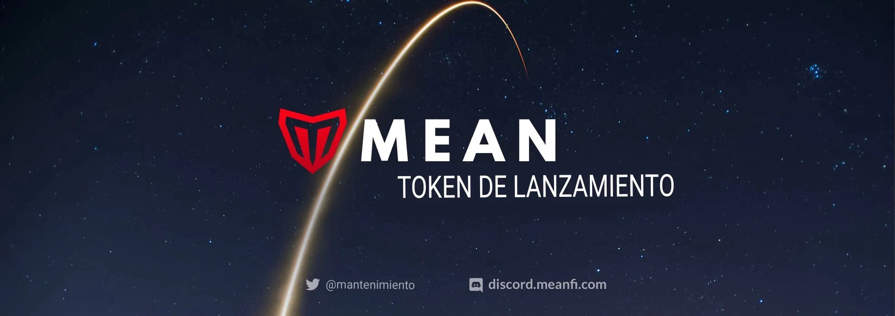

# El Lanzamiento del token MEAN e IDO

Tenemos una actualización cargada para todos ustedes. El buen tipo de cargado

TL;DR

* El MEAN IDO se pondrá en marcha el 15 de diciembre a las 13:00 UTC. Subastaremos hasta 10 millones de tokens MEAN (4,76% de nuestro suministro total).
* Estamos haciendo algo especial, nuevo y emocionante, y la comunidad está en el centro de todo. Es una mezcla de un estilo Mango + Subasta Justa + Launchpad. Lo estamos llamando un lanzamiento medio
* Mean Launch es un lanzamiento centrado en la comunidad que desincentiva a las ballenas y los bots a jugar en el juego IDO. De todos modos, absorben la diversión del proceso y a nadie le gustan.

## Humildes Comienzos 

Desde el lanzamiento de MeanFi en Solana Mainnet el 17 de septiembre, hemos visto nada menos que un crecimiento, apoyo y compromiso extraordinarios de todos los lados del ecosistema. Resumamos dónde estamos hoy al comenzar el último mes de 2021:

1. Tenemos increíbles inversores de primer nivel profundamente conectados a través de los universos TradFi y Crypto, incluidos SoftBank, Three Arrows Capital, DeFiance Capital y SkyVision Capital.
2. Nuestra comunidad ahora tiene más de 90 mil miembros en Twitter y Discord. También tenemos más de 1,000 miembros de DAO en nuestro sistema de mérito y reputación, poniendo sus talentos a trabajar todos los días para hacernos mejores y más fuertes.
3. Ahora damos servicio a más de 60 mil cuentas en MeanFi y acabamos de pasar $ 1 mil millones en volumen de transacciones. Nuestro alcance sigue creciendo diariamente a un ritmo sin precedents.
4. Nuestro círculo de asociación sigue expandiéndose, y más allá de las increíbles colaboraciones que tenemos con los mejores proyectos como Grape, Solrise, Port, Solanium y Synthetify, muchos nuevos y emocionantes se están uniendo a la #MeanLife, como Jupiter, UXD, Parrot y Marinade.
5. La visión de Mean Protocol de hacer de Money Streams una capa de interoperabilidad entre cadenas para protocolos ha cautivado la atención de todo un ecosistema. Hemos cerrado más de 18 asociaciones con otros proyectos que no pueden esperar para ser parte de un futuro impulsado por Money Streams con muchos ya en el proceso de integración.

## El IDO MEAN 

Estamos haciendo algo especial para nuestro IDO, con un montón de cosas “vistas por primera vez aquí”. Lo llamamos un “lanzamiento medio”, y es un enfoque de IDO de Community-First que toma las mejores partes de una plataforma de lanzamiento, un contrato al estilo Mango y una subasta justa de LBP, y tira las partes malas.

Es un evento de 48 horas que maximiza la transparencia, el descubrimiento de precios, la participación y la distribución justa del token a través del uso de flujos de dinero y teoría de juegos para promover la alineación extrema de incentivos de la comunidad.

El IDO MEDIO estará activo a [https://ido.meanfi.com](https://ido.meanfi.com), y hasta 10,000,000 (4.76%) del suministro total de MEAN de 210,000,000 se reservarán para el evento. El 10% de los ingresos de la IDO se destinará a proporcionar liquidez en el mercado después de que finalice la IDO, y el 20% a financiar la tesorería operativa para el desarrollo. El 70% restante volverá a la Tesorería Comunitaria, que seguirá dando vida a los productos de Mean DAO en los años venideros. Como probablemente ya haya notado, estas divisiones se correlacionan exactamente con nuestra tokenomics centrada en la comunidad.

Hay muchas cosas que están ocurriendo en torno al lanzamiento de MEAN: una plataforma de lanzamiento de Solanium, nuestro portal IDO, la inclusión en Serum, Orca, Raydium y Gate.io, y las recompensas de liquidez y de cultivo. Aquí hay una línea de tiempo que hará que esto sea más fácil de seguir:

Los horarios definitivos de las actividades pueden cambiar un poco mientras sincronizamos los calendarios con nuestros socios de lanzamiento, pero no mucho. Síganos en Twitter para conocer las últimas actualizaciones.

## Una nueva forma de lanzarse 

Hay muchas formas de lanzar un token, como las plataformas de lanzamiento, las subastas justas y los pools de liquidez (LBP). Cada enfoque se ha basado en el registro anterior de cosas que funcionaron bien y cosas que no. Estamos haciendo otra iteración de este ciclo con nuestro Mean Launch recogiendo las mejores partes de los gigantes anteriores que nos han llevado hasta aquí. Esperamos que nuestro análisis y nuestros esfuerzos sirvan de ejemplo para futuros proyectos sobre cómo hacer un lanzamiento de tokens con un enfoque que dé prioridad a la comunidad.

## Proceso y Transparencia 

Lanzamiento de Mean se rige por un contrato inteligente que guía el proceso de forma totalmente libre de permisos, autocustodia y confianza. No hay administradores entre bastidores tocando los mandos, sólo el participante y el contrato interactuando entre sí. El contrato IDO de Mean Lanzar es de código abierto, y podrás inspeccionarlo y ver cómo se establecen las reglas para todos, al igual que el contrato IDO de Mango Markets.

## Descubrir el Planzamientorecio 

Esta era una tarea difícil, y tomamos prestadas algunas cosas de los Balancer Liquidity Bootstrapping Pools y de la subasta de la feria de lanzamiento de tokens de Copper y pusimos esas ideas en nuestra propia curva de unión de descubrimiento de precios. Empieza alta y siempre baja en una función de correlación inversa, para que la gente pueda invertir cuando sienta que el precio es el adecuado para ellos.

## Evitar las Valoraciones Desbocadas 

Las valoraciones desbocadas ocurren cuando la demanda del token es extremadamente alta durante la fase de la IDO, lo que hace que la valoración totalmente diluida suba tanto que sólo puede bajar en los meses siguientes. Esto suele traer consigo un nivel de malestar por parte de la comunidad y de las personas que participaron en la IDO, ya que ahora tienen en su poder un token que puede bajar mucho de precio antes de alcanzar un punto estable.

Este no es siempre el caso: si el proyecto que lanza el token tiene una hoja de ruta consistente (como Mango Markets) y sigue ejecutando bien su visión, siempre hay más crecimiento por delante para que el valor siga subiendo. Pero las condiciones del mercado y el futuro, en general, son desconocidos, y es difícil para la mayoría de los proyectos mantener un hype continuo al nivel del lanzamiento del token.

Por eso pensamos que el enfoque tradicional de la plataforma de lanzamiento es el mejor. Al establecer un límite máximo de la valoración total de la empresa, nos aseguramos de no vender más tokens de los que el mercado está dispuesto a comprar, y podemos mantener el descubrimiento de precios al tiempo que protegemos a los participantes de una valoración muy alta, ya que está limitada.

## Participación Justa 

Al igual que Mango Markets, el lanzamiento de Mean es un evento abierto que dura 48 horas. Nos calificamos con un 4 y no con un 5 porque, a diferencia de los estilos de subasta que pueden crecer infinitamente, tener un tope de valoración y proteger el token, también significa que no podemos dejar que un número ilimitado de personas invierta en MEAN a través de la IDO. Una vez que se alcanza el límite de valoración, todos los demás participantes se unen a una lista de espera que rellenará a las personas de la asignación garantizada que cambien de opinión en el plazo de 48 horas.

Otra cosa especial que tenemos en cuanto a la participación es nuestra curva de vinculación de contribución máxima. Esta curva limita la cantidad máxima que cualquiera puede aportar en cualquier momento. Invertir pronto significa que puedes invertir más, mientras que esperar hasta el final significa que estarás muy limitado en tu cantidad de aportación.

## Distribución Justa 

Cuando se piensa en la distribución de tokens de diferentes proyectos y plataformas, el aspecto más importante es si sus tokens están desbloqueados o conferidos. Es útil desbloquear los tokens cuando se quiere optimizar el volumen de operaciones y el movimiento (hola👋 tokens meme). Es más útil aprovechar los calendarios de vesting cuando quieres asegurarte de que los incentivos están alineados entre los titulares de tus tokens y el proyecto, como los tokens para el Equipo y los Inversores.

Una de las piezas centrales de Mean Protocol son los flujos de dinero. Son increíbles para el pago de nóminas, la gestión de tesorería y la distribución de tokens (también conocida como vesting). El vesting también alinea a los inversores con el proyecto con una visión a largo plazo, y no hace falta decir que queremos inversores y una comunidad que piense en Mean DAO con una visión a largo plazo. Por esta razón, el 100% de nuestra distribución inicial va a ser una distribución con derechos adquiridos que aprovecha nuestros propios contratos de Streaming de dinero.

## Lanzamiento de Mean: La comunidad primero 

Este es un gran paso adelante y esperamos ser un ejemplo para futuros proyectos sobre cómo proteger a la comunidad durante el lanzamiento de un token. Al poner estos límites a la fijación de precios y a la valoración, nos aseguramos de que el token tenga espacio para crecer tras el lanzamiento, lo que hará feliz a nuestra comunidad.

Escribimos este artículo para compartir el enfoque metódico que adoptamos para tomar nuestras decisiones y la idea que hay detrás de Mean Launch. Como siempre, esto no es un consejo financiero; por favor, haz tu propia investigación.

Habrá un vídeo en el que se explicará cómo funciona todo para que puedas visualizar tus opciones. Estará en directo en el portal de lanzamiento en los próximos días y durante todo el evento principal.

El portal ya está disponible en [https://ido.meanfi.com](https://ido.meanfi.com).

## Participar 

Son tiempos emocionantes, nuestra hoja de ruta está cobrando vida, y mientras nos dirigimos a nuestra visión más amplia de convertirnos en el puente que lleve a los próximos mil millones de personas a DeFi, no podemos pensar en un futuro mejor en torno a Mean DAO que ver a nuestra comunidad disfrutando de los beneficios de un ecosistema de tokens saludable.

Mantente en contacto con nuestro progreso cada semana, y únete a la revolución DeFi consultando nuestra página web, uniéndote al Discord de Mean DAO, y siguiendo a [@MeanFinance](http://twitter.com/MeanFinance) en Twitter.
